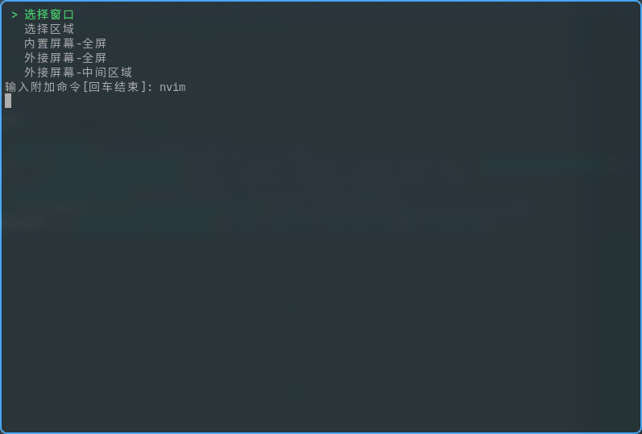

# [ "" <> = [] ? : '' * / HI WORLD;](#TOP)

# [ c'blog](https://yaocc.cc) -- [ bilibili野生UP主](https://space.bilibili.com/303522232/)

<table border="0">
  <tr>
    <td>
      
    </td>
    <td>
      
    </td>
  </tr>
</table>

# [ linux/terminal 重度依赖者](https://www.bilibili.com/video/BV1Ef4y1Z7kA)

  
展示图 👈

  
  

1. dwm -- 168|50 -- [yaocccc/dwm](https://github.com/yaocccc/dwm)
2. st  -- 13|11 -- [yaocccc/st](https://github.com/yaocccc/st)
3. tabbed st多tab支持 -- 3|0 -- [yaocccc/tabbed](https://github.com/yaocccc/tabbed)
4. 自用脚本仓库 -- 17|15 -- [yaocccc/scripts](https://github.com/yaocccc/scripts)
5. omz(forked from oh my zsh) -- 24|7 -- [yaocccc/omz](https://github.com/yaocccc/omz)
6. 基于小鹤双拼+二笔辅助码实现的rime方案 -- 7|3 -- [yaocccc/rime](https://github.com/yaocccc/rime)
7. 壁纸仓库(我二次元浓度不高的) -- 17|7 -- [yaocccc/wallpaper](https://github.com/yaocccc/wallpaper)
8. github用户页 -- 18|3 -- [yaocccc/yaocccc](https://github.com/yaocccc/yaocccc)

# [ nvim/vim 深度用户](https://github.com/yaocccc/nvim)

  
展示图 👈

  
  

相关配置和部分自己写的插件:

1. 个人nvim配置 -- 82|20 -- [yaocccc/nvim](https://github.com/yaocccc/nvim)
2. 根据`{}`高亮代码块 -- 29|0 -- [yaocccc/nvim-hlchunk](https://github.com/yaocccc/nvim-hlchunk)
3. 状态栏标签栏插件 -- 24|2 -- [yaocccc/nvim-lines.lua](https://github.com/yaocccc/nvim-lines.lua)
4. 快速注释插件 -- 5|2 -- [yaocccc/vim-comment](https://github.com/yaocccc/vim-comment)
4. 快速操作`"" () {}`等pair的插件 -- 9|2 -- [yaocccc/vim-surround](https://github.com/yaocccc/vim-surround)
5. 最小化在标记栏展示mark -- 1|1 -- [yaocccc/vim-showmarks](https://github.com/yaocccc/vim-showmarks)
6. 快速echo、print、console.log -- 3|1 -- [yaocccc/vim-echo](https://github.com/yaocccc/vim-echo)

  
PS: 关于本仓库自动更新star、fork数量的实现

  ---

  主要见以下两个workflow文件 具体见注释  
  更新readme [./github/workflows/up.yml](https://github.com/yaocccc/yaocccc/blob/master/.github/workflows/up.yml)  
  调用更新动作 [./github/workflows/call.yml](https://github.com/yaocccc/yaocccc/blob/master/.github/workflows/call.yml)  

## Support

 

